## 컴퓨터는 왜 0과 1로 신호를 전달할까?  

손가락이 10개인 인간은 0부터 9까지 10가지의 숫자로 세상을 표현하고 이해하는데 10진법이 익숙하다. 인류의 역사에는 10진법 수동 계산기가 톱니바퀴를 사용해서 만들어지기도 했다. 아래 사진과 같은 계산자(NASA에서 아폴로 11호를 달에 착륙시킬 때 사용한 계산자)는 로그의 성질을 이용해서 다양한 분야에서 과거부터 지금까지 쓰이는 훌륭한 10진법 계산 장치이다. 이는 인간이 당시 사용할 수 있는 기술을 최대한 활용해 어떤 문제를 해결하는지 보여주고 있다.

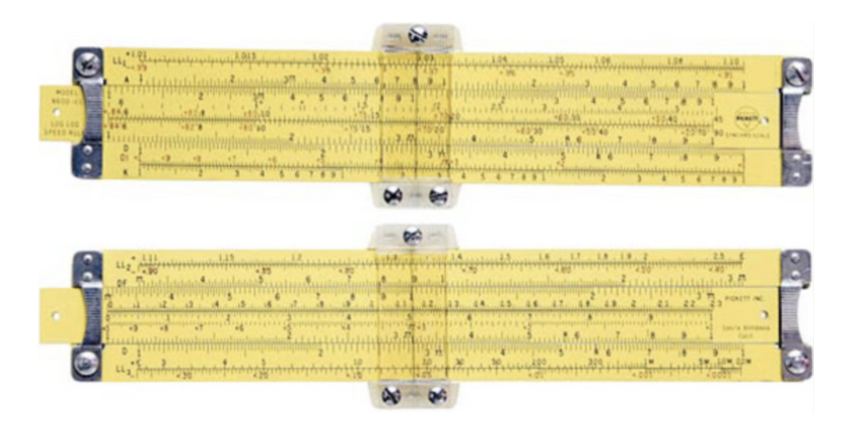

그러나 현대의 고도화된 계산 장치는 더이상 톱니바퀴 계산기나 단순한 계산자가 아니라 **전기를 사용하는 컴퓨터**이다. 현대의 과학 기술을 활용해 만든 컴퓨터는 전자의 움직임을 활용한 것이 그 원리이다. 

컴퓨터 클록 속도가 4GHz라는 말은 1초에 40억 가지 계산을 처리할 수 있다는 뜻이다. 다시 말해, 빛의 속도로 움직이는 전자가 고작 75mm를 이동했을 때 하나의 계산이 처리된다는 뜻이다! 이렇게나 빠른 컴퓨터는 0과 1 두 가지로 이루어져 있다고 한다. 컴퓨터는 인간이 만든 것인데 왜 과거처럼 10진법이 아니라 2진법으로 컴퓨터가 만들어지게 되었을까?

첫 번째 이유는 2진법이 숫자를 세고 계산하는데 있어서(직관성이 떨어지더라도) 효율적기 때문이다. 그리고 현실적으로 전이 함수transfer function를 활용해서 10가지 종류(0~9까지)를 나타내는 물리적인 장치(10진 문턱값threshold)를 만드는 것보다 2진 문턱값을 가진 장치(0, 1 두 종류를 표현하는 장치)를 만드는 것이 훨씬 비용이 저렴하고 간단하기 때문이다. 쉽게 말해 전기가 흐르는지 아닌지 **두 가지 상태값을 가지는 전기 회로를 만드는 것이 현실적으로 훨씬 간단하고 경제적이기 때문**이다. 따라서 현대의 하드웨어는 두 가지 상태를 가지는 비트를 사용해서(2진법을 사용해서) 만들어진다.

## 컴퓨터의 언어 체계

컴퓨터를 만들기 위해 인간의 직관성을 포기하더라도 효율적인 2진법 체계를 사용하는 이유를 알게 되었다. 따라서 우리는 어떻게 현실(10진법 수, 실수, 인간의 언어, 색깔 등)을 2진법으로 대응하여 표현할지 그 컴퓨터 언어 체계에 대한 이해가 필요하다. 실제로 프로그래밍 언어를 도서를 보면 초반에 2진법과 비트 연산자에 대한 내용이 담겨 있다.

### 비트로 표현하기

#### 논리 연산

참과 거짓을 나타내고 계산하는 논리 연산은 불리언 대수를 사용하여 2진법으로 표현하기 쉽다. NOT, AND, OR과 같은 연산자를 사용하여 논리 연산을 할 수 있다.

#### 정수

정수의 경우 정해진 비트의 갯수에 따라 표현할 수 있는 값의 범위가 제한된다. 따라서 논리 연산을 활용하여 2진수 덧셈을 할 때 제한된 비트의 갯수로 표현할 수 있는 범위를 벗어날 때 오버플로overflow가 발생할 수 있다. 값의 표현 범위를 줄이더라도 MSB에 오버플로가 일어났는지에 대한 정보를 담는 방식으로 오버플로가 발생했는지에 대한 여부를 확인 할 수 있다. 

음수의 표현까지 고려한다면 부호와 크기에 대한 정보가 비트에 담겨있어야 한다. 어떻게 정수를 이진법으로 표현할 것인가에 대한 방식은 다양하다. 1의 보수one's coplement, 2의 보수two's complement와 같은 방식으로 정수가 표현 되었을 때 각 방식에 따라 같은 이진법이라도 문맥에 따라 실제로 표현되는 수가 다르다는 것을 알고 있어야 한다. 현대의 컴퓨터는 일반적으로 중복이 없고 넓은 범위의 수를 표현하며 사칙 연산에서 값의 부호를 고려하지 않아도 되는 2의 보수 방식을 사용하고 있다. 

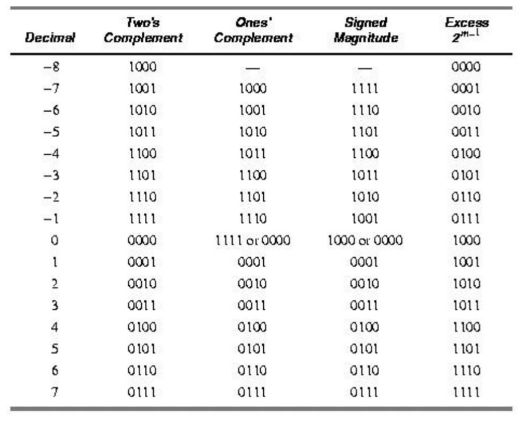

#### 실수

정수와 마찬가지로 같은 2진법이라도 문맥에 따라 실수를 표현하는 방식이 달라질 수 있다. 실수를 표현할 때 같은 수의 비트를 사용하더라도 낭비되는 비트 조합을 최소화하고 반올림을 쉽게 하며 정밀도precision을 높이기 위한 여러 가지 트릭이 사용된다. 현대의 프로세서들은 **IEEE 754 부동소수점 수 표준**을 사용하고 있다. IEEE 754에서 편리한 점 한 가지를 들자면 양의 무한대나 음의 무한대를 표현하는 비트 패턴 혹은 잘못된 산술 연산을 했을 때의 비트 패턴을 NaN(not a number)이라는 특별한 값으로 표현된다는 점이다.

#### 8진법과 16진법

사람이 2진수를 보기에는 너무 길다. 2진수를 8진법과 16진법으로 바꾸는 것은 구간별로 잘랐을 때 딱 맞게 떨어진다. 8진법과 16진법은 2진법 보다 짧아 인간이 쉽게 읽을 수 있으므로 많이 사용하고 있다. 따라서 프로그래밍 언어에서도 2진수를 제공하는 언어는 거의 없고 보통 8진법이나 16진법을 지원한다.

#### 텍스트

개발자라면 알고 있는 아스키 코드ASCII는 알파벳(혹은 제어 장치를 제어하는 제어 문자control character)에 대해 7비트 대응시켜 인간의 언어를 2진법으로 대응시키고 있다. 시간이 지나면서 다양한 언어를 지원하기 위해 유니코드Unicode라는 새로운 표준은 16비트 코드를 부여했다. 그 후에도 더 다양한 값을 표현하기 위해 21비트 까지 확장되었다.

### 인코딩

컴퓨터는 7비트값을 처리하도록 설계된 것이 아니기 때문에 8비트로 아스키 코드를 저장한다. 인코딩이란 다른 비트 패턴을 표현하기 위해 사용하는 비트 패턴이다. UTF-8라는 이름이 더 익숙한 유니코드 변환 형식 8비트라는 인코딩 방식은 하위 호완성과 효율성 때문에 가장 널리 쓰이는 인코딩 방식이다. 

UTF-8은 8비트 덩어리(옥텟)의 시퀀스로 인코딩하는 방식으로 MSB에 쪽에 있는 비트들이 옥텟의 길이를 표현하기에 문자의 경계를 파악하기 쉽다. 아래 UTF-8 인코딩 예제를 참고해보자.

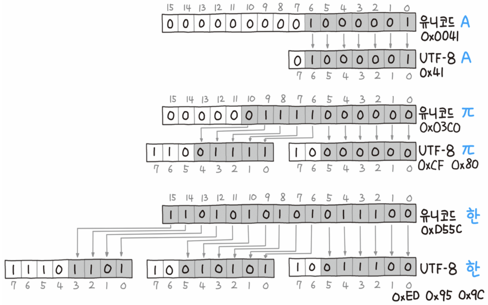

원본 \<파이썬 알고리즘 인터뷰\> p.164, 책만, 2020. [사진 출처](https://namu.wiki/w/UTF-8)

상황에 따라 아래와 같은 인코딩이 사용되기도 한다.

- 베이스64 인코딩 : 과거의 QP 인코딩보다 효율적으로 출력 가능하게 변경하는 인코딩 방식이다. 전자우편 첨부파일 전송에 여전히 사용중이다.
- URL 인코딩 : 웹 페이지 URL에 대한 인코딩이다. 으로 `%`뒤에 어떤 문자의 16진 표현을 덧붙이는 방식으로 인코딩하며 `/`문자에 특별한 의미를 부여한다.
- 색 인코딩 : 웹에서 16진 트리플렛hex triplet(`#000000` 검은색과 같은 방식)으로 색을 표현하며 8비트 색값 두 자리 문자로 된 16진 표기로 바꾼다.

## 전자 회로와 조합 논리

현대적인 전자적 구현 기술 이전에는 릴레이나 진공관이 사용되었다. 반도체(도체와 부도체 사이를 오갈 수 있는 물질)을 사용한 트랜지스터를 활용해서 적은 전력으로 신뢰할 수 있는 논리 회로를 만들어 낸다. 저렴하고 작으며 에너지 효율적인 회로가 끊임없이 연구되고 있다. 컴퓨터도 결국 복잡한 회로의 집합체이다. 현대에서 **조합 논리를 어떻게 물리적으로(전자 회로로) 구현하는지** 알아보자.

### 논리 게이트

현대에서는 논리 게이트를 활용하여 하드웨어 설계 과정이 단순해졌다. 아래에 사진에 논리 게이트의 종류와 진리표가 있다. 실제로 게이트가 어떻게 생겼는지 저항과 트랜지스터로 구성된 AND 게이트 예시가 있다. 회로를 논리 회로를 그릴 때는 표에 나타난 Symbol 형태로 회로를 그리게 된다. 논리 게이트를 복잡하게 활용하면 사칙 연산과 같은 여러 가지 논리 계산의 흐름을 구현할 수 있다. 

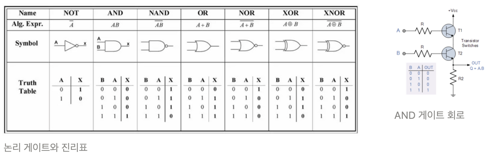

즉, 조합 논리combinational logic를 구현한다는 것은 논리 게이트의 조합을 활용하는 것이다. 각각의 논리 게이트는 들어오는 입력 값에 대해 특정 출력 값을 가지게 된다. 아래에 반가산기half adder의 논리회로를 아래에 예시로 들었다. A, B 비트 덧셈 결과를 합sum과 올림carry으로 나타내고 있다.

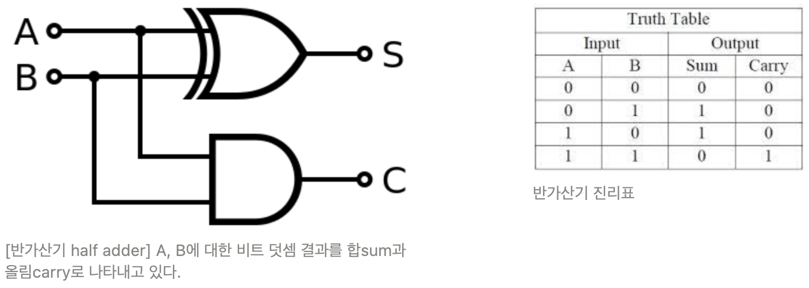

### 복잡한 논리 회로

복잡한 논리를 요하는 회로도 결국 여러 논리 게이트의 조합으로 구현할 수 있다. 그 중 자주 사용되는 로직은 컴포넌트처럼 하나의 단위로 각자 이름이 붙어 있다. 인코딩 한 결과를 다시 개별 비트의 집합으로 만들어주는 **디코더**decoder, 여러 입력 중 한 입력을 선택하는 기능을 가지는 **셀렉터**selector 등의 논리 회로가 그 예시이다. 학부시절 시험 문제에서 반가산기half adder와 전가산기full adder를 활용하여 곱셈기multiplier를 그리는 문제를 푼 기억이 난다. 중요한 것은 간단한 회로를 조합하여 더 복잡한 논리 회로를 만들어 낼 수 있다는 것이다. 아래는 2x4 디코더 회로와 진리표이다.

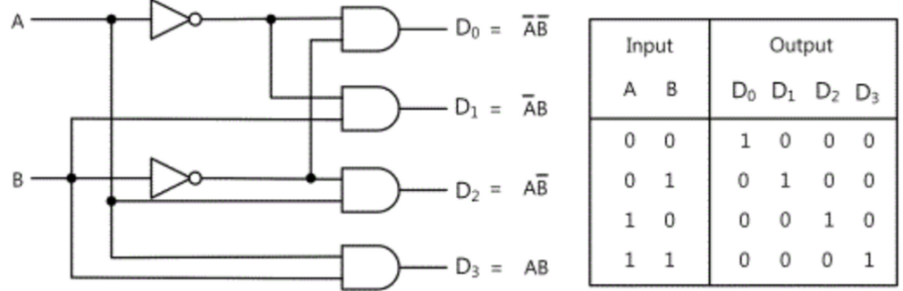

## 메모리와 디스크

위에서 다룬 조합 논리는 입력에 의해서 출력이 결정된다. 즉, 조합 논리만으로는 흐름의 일부분(혹은 최종 결과)을 **기억(저장)할 수 없다**. 하지만 입력뿐만 아니라 과거의 상태를 고려한 순차 논리sequential logic를 구현할 경우 **비트를 기억하는 방법**이 있어야 한다. 컴퓨터에는 많은 데이터들이 저장되어 있고 그 뜻은 컴퓨터가 비트를 기억하고 있다는 뜻이다. **메모리와 디스크가 어떻게 비트를 저장하는지** 알아보자.

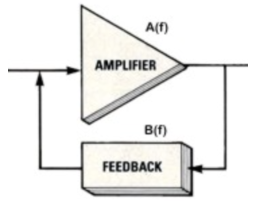

### 시간 표현과 상태 기억

회로에서 시간 측정은 주기를 이용해 측정할 수 있다. 아래 회로는 출력 값을 그대로 다시 입력값이 되먹임feedback으로서 전파 지연propogation delay에 의해 출력이 0과 1사이를 진동oscilate하는 회로이다. 안정적인 주파수로 진동하는 발진자일수록 더 정확히 시간을 측정할 수 있을 것이다. 보통 크리스털을 활용하여 더 정확한 발진자를 만들게 된다.

컴퓨터에서 발진자는 시간을 셀 수 있게 하는 신호 클록clock을 제공하는 역할을 하게된다. 회로의 최대 클록 속도가 빠르다는 것은 국 회로의 전파 지연 시간이 짧다는 뜻이 된다. 컴퓨터는 이런 방식으로 시간을 표현하는 근원을 사용한다.

정보(비트)를 기억하는 회로의 기본 요소를 플립플롭flip-flop 혹은 래치latch라는 이름으로 부른다. 역시나 논리 게이트로 표현되며 어떤 종류가 있으며 어떻게 동작하는지 자세한 사항은 아래 링크에서 확인할 수 있다. 기억을 안정적으로 하기 위해서 어떤 식으로 발전되었는지 초점을 맞추어 보면 좋다.

[플립플롭 - 위키백과, 우리 모두의 백과사전](https://ko.wikipedia.org/wiki/%ED%94%8C%EB%A6%BD%ED%94%8C%EB%A1%AD#SR_NOR_%EB%9E%98%EC%B9%98_2)

그 중 **D 플립플롭**은 0에서 1로(혹은 1에서 0으로) 바뀌는 순간 최종 출력이 바뀌는 방식(이러한 방식을 에지에서 상태가 변하는이라고 표현한다)으로 구현하여 **출력(저장된 데이터)이 입력과 무관하게 안정적으로 유지되어 광범위하게 사용되는 회로**이다. 즉, 하나의 비트가 들어왔을 때 새로운 값으로 변경시키지 전까지 그 비트를 계속해서 출력값으로 내뱉는 회로의 역할을 하는 것이다.

#### 레지스터

클록을 공유하는 여러 D 플릭플롭을 한 패키지에 넣어서 레지스터register라는 회로를 쉽게 구현할 수 있다. 예를들어 가산기(덧셈 회로)의 결과를 **8비트로 나타낼 때 8개의 비트를 8개의 D 플릭플롭으로 구성된 레지스터로 값을 저장할 수 있다**. 아래 그림은 8비트 데이터를 담는 레지스터를 나타내고 있다. DFF는 D플립플롭을 나타내며 하나의 클록을 공유하는 것을 확인할 수 있다. D0~D7까지를 가산기의 8비트 결과라고 생각하면 그 결과가 Q0~Q7에 저장되는 것이다.

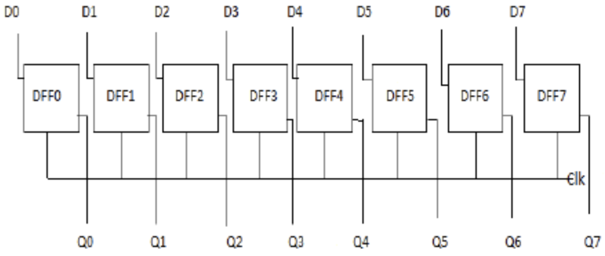

#### 메모리

큰 레지스터, 여러 레지스터를 사용하면 많은 데이터를 기억할 수 있다. 하지만, 저장할 때 어떤 레지스터를 사용할 지, 그리고 데이터를 꺼낼 때 어떤 레지스터에서 꺼내야 할지가 문제이다. 이 문제를 해결하기 위해 레지스터에 번호를 부여한다(이 번호를 주소address라고 한다). 이 때 레지스터들과, 디코더, 셀렉터를 활용하여 회로를 구성하여 **원하는 레지스터에 데이터를 쓰거나 원하는 레지스터를 읽을 수 있게 된다**. 그 묶음을 메모리 컴포넌트라고 부른다. 아래 그림을 보면 왼쪽에 디코더, 가운데 레지스터, 오른쪽에 셀렉터가 위치해 있다.

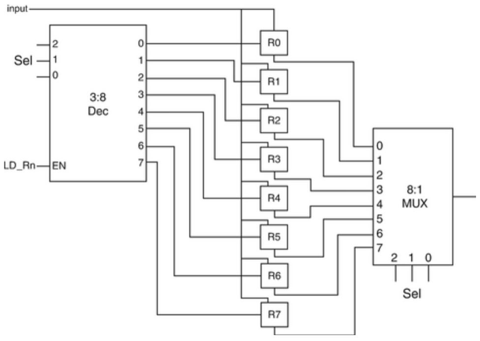

하드웨어 설계자는 회로에 어떻게 선을 잘 연결할지 고민한다. 그들은 메모리를 동시에 읽고 쓰는 경우가 거의 없다는 사실을 활용해 연결을 많이 줄였다. 아래 그림과 같이 입력과 출력 데이터 연결을 합쳤다(예를 들어 입력이 1이면 출력은0이 되도록). 데이터 비트 덩어리 이동 수단을 데이터 버스data bus, 주소와 관련된 비트 덩어리 이동 수단을 주소 버스address bus라고 부른다. 아래 그림은 단순화한 메모리의 도식이다.

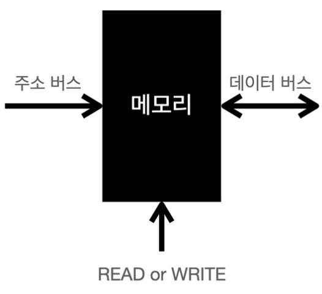

메모리 크기가 커질수록 주소로 연결해야할 비트 수가 많아진다. 메모리 주소를 행과 열의 두 덩어리로 나누어 메모리 배열을 만들고 멀티플랙싱으로 주소 라인의 수를 반으로 줄일 수 있다. 그리고 멀티플랙싱한 주소를 저장하기 위한 레지스터가 있으면 된다. 오늘날의 대형 메모리 칩에서는 이러한 방식으로 주소를 처리한다. 

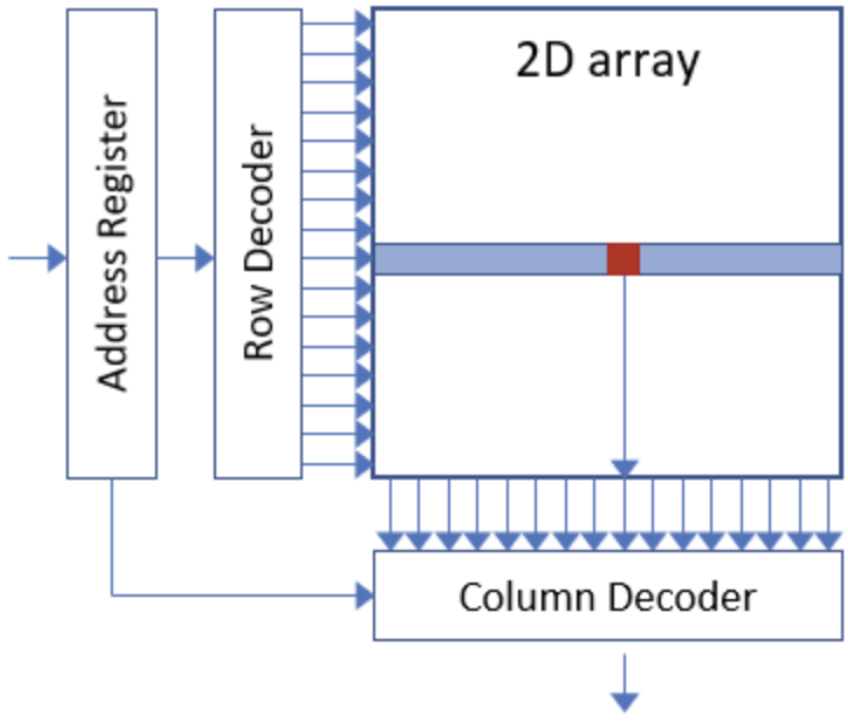

메모리 칩은 깊이(depth, 행의 수)X너비(width, 열의수) 형태로 표현한다. 예를들어 256X8 칩은 너비가 8 깊이가 256개인 메모리 지점을 제공한다.

#### RAM

지금까지 본 메모리를 임의 접근 메모리(RAM : random access memory)라고 부른다. 주소 레지스터를 활용하면 메모리 위치 중 원하는 곳은 어디든 원하는 순서로 쓰거나 읽을 수 있는 것이다. 프로그래밍에서는 함께 사용되는 요소들을 같은 행에 넣어두면 성능이 훨씬 좋아진다는 점을 고려할 수 있다.

SRAM이나 DRAM과 같은 RAM은 기본적으로 휘발성 메모리이며 전원 공급이 끊어지면 데이터가 모두 사라진다. 비휘발성 메모리를 코어 메모리라고 부르며 역사적으로 오래된 기술(전원 공급이 끊기더라도 메모리를 가지는 방식)이며 지금도 활발히 연구가 되고 있다.

#### ROM과 디스크

읽기 전용 메모리(ROM : read-only memory)는 전자레인지와 같이 변하지 않을 프로그램을 내장해야 하는 장치에서 유용하다. 역사적으로 많은 시도와 발전이 있었으며 직접 프로그래밍으로 ROM을 만들어내는 방식이 많이 쓰였다. EEPROM과 같이 지울 수 있는 ROM도 나타나면서 사실상 기술적으로 RAM이 나타나기도 했다.

대량 저장장치로 알려진 디스크 드라이브는 자화된 판platter에 비트를 저장하는 방식으로 데이터를 담고 있다. 최근 디스크들은 1분에 7200회(7200RPM) 정도 회전하며 디스크 헤드가 원하는 데이터를 찾아낸다. 디스크 드라이브는 **기록 밀도와 속도를 맞바꾼 기억장치**이다. 방금 지나간 데이터를 읽으려면 회전판이 거의 1바퀴를 돌 때까지 기다려야 한다. 그러나 RAM과 달리 주소나 데이터 연결을 위한 공간이 필요 없다.

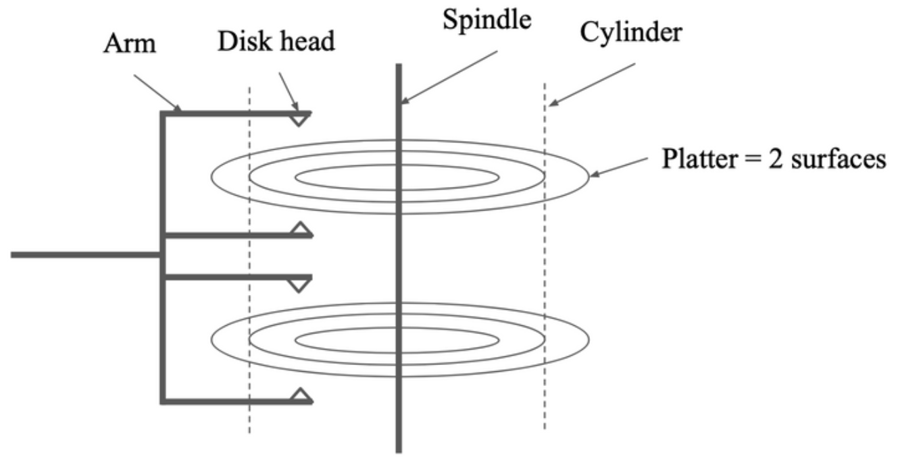

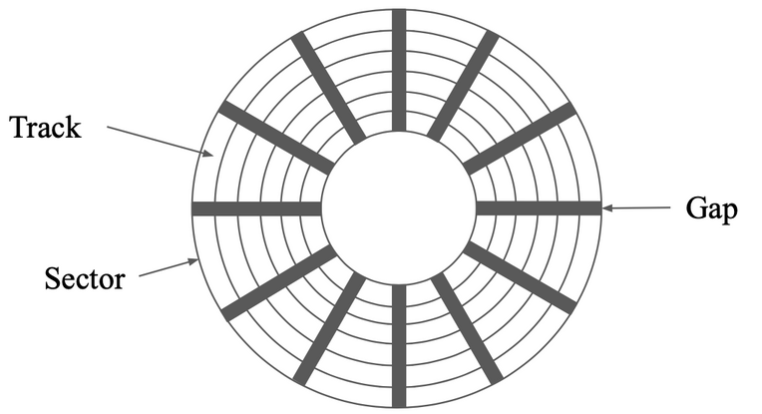

플래시 메모리flash memory는 최근에 나타난 EEPROM 유형의 매체로 읽을 때는 임의 접근 장치이고 쓸 때는 블록 접근 장치이다. 읽을 때는 RAM처럼 원하는 위치를 마음대로 읽을 수 있다. 데이터를 기록할 때는 일정 블록을 모두 0으로 바꾸고(원하는 비트만 0으로 되돌릴 수 없다) 데이터를 새로 채워넣는 형태이다.

요즘의 디스크 드라이브는 이제는 SSD로 널리 알려진 고체 상태 드라이브solid-state drive로 바뀌고 있는데 SSD는 디스크 드라이브 모양의 패키지에 넣은 플래시 메모리와 같다. 기존의 디스크드라이브의 탐색 속도seek time는 헤드를 한 트랙에서 다른 트랙으로 옮길 때로 1~15ms 시간이 소요되었지만, SSD의 경우 0.08ms~0.16ms로 훨씬 빠르다. 다른 지표에서도 SSD가 훨씬 빠르다.

> 컴퓨터가 어떤 언어를 사용하고 있으며 그 언어를 표현하기 위해 어떻게 논리 회로가 구성되는지 알아보았다. 그리고 컴퓨터가 시간을 어떻게 인식하며 데이터를 저장하는지(메모리를 만드는지) 살펴보았다.