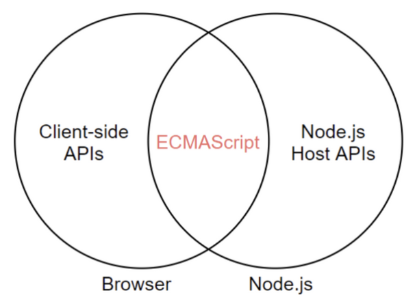
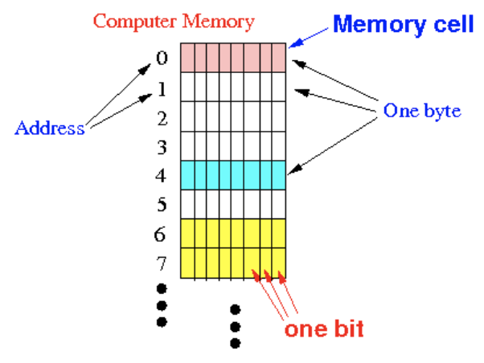
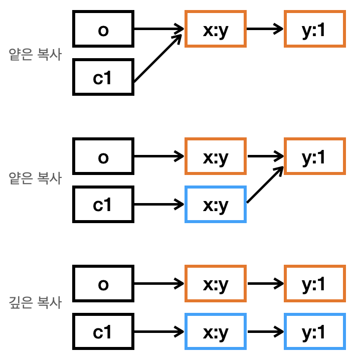

## 자바스크립트

### 자바스크립트의 역할

자바스크립트는 애초에 브라우저를 위해 태어난 프로그래밍 언어이다. 현재 자바스크립트는 모든 브라우저의 표준 프로그래밍 언어로 더 나아가 백엔드의 영역까지 사용할 수 있는 범용 어플리케이션 개발 언어로 성장했다. 일반적으로 **자바스크립트**라고 하면 프로그래밍 언어로서 기본이 되는 **ECMAScript와** 브라우저가 별도로 지원하는 클라이언트 사이드 **Web API**로 되어 있다. **Node.js**의 경우 **ECMAScript**와 **Node.js 고유의 API**를 지원한다. 예를 들어 파일 생성, 수정과 같은 파일 시스템은 Node.js에서 제공하지만 브라우저는 보안상의 이유로 제공되지 않는다. 반대로 DOM조작과 같은 API는 브라우저에서 제공하지만 Node.js에서는 제공되지 않는다.



### 자바스크립트의 특징

자바스크립트는 **웹 브라우저에서 동작하는 유일한 프로그래밍 언**어이다. 그리고 개발자가 별도의 컴파일 작업을 수행하여 실행파일을 생성하는 컴파일러 언어가 아니라 인터프리터 언어에 속한다. 인터프리터는 소스코드를 한 줄씩 바이트코드로 변환하여 즉시 실행하고, 컴파일러는 빠르게 동작하는 머신 코드를 생성하여 최적화한다. V8과 같은 대부분의 모던 자바스크립트 엔진은 명시적인 컴파일 단계를 거치는 것은 아니지만, 복잡한 과정을 통해 일부 소스코드를 컴파일하여 실행한다. 즉, 인터프리터와 컴파일러의 장점을 결합해 실행속도가 느리다는 인터프리터 코드의 단점을 어느정도 해결했다. 컴파일러와 인터프리터의 기술적 구분이 모호해져 가고 있긴 하지만, 기본적으로 자바스크립트는 런타임에 컴파일이 되고 실행 파일이 생성되지 않으며 인터프리터 없이 실행할 수 없기 때문에 인터프리터 언어로 분류한다.

자바스크립트는 명령형imperative, 함수형functional, 프로토타입 기반prototype-based 객체지향 프로그래밍을 지원하는 **멀티 패러다임 프로그래밍 언어**이다. 다른 객체지향 언어와의 차이점에 대한 논쟁이 있기는 하지만 자바스크립트는 **프로토타입 기반의 객체지향 언어**이다.

## 변수

### 변수란 무엇이고 왜 필요한가?

컴퓨터는 연산을 수행하는 부품(CPU)과 데이터를 기억하는 부품(메모리)가 나뉘어져 있다. 그 중 메모리는 데이터를 저장 할 수 있는 메모리 셀의 집합체로 셀의 크기(1 바이트) 단위로 데이터를 저장하거나 읽어들인다. 각 셀은 고유한 메모리 주소를 가진다. 예를 들어, 4GB 메모리는 `0x00000000`부터 `0xFFFFFFFF`까지의 메모리 주소를 갖게 된다.



3과 5를 더하는 연산이 일어난다고 가정해보자. 예를 들어 1번 메모리 셀과와 3번 메모리 셀에 각각 숫자 3과 5가 저장되어있다고 했을 때, CPU는 1번, 3번 메모리 셀에 담긴 값을 읽어 덧셈 연산을 한 후 다른 메모리 주소에 8을 저장할 것이다. 이제 프로그래밍 언어가 이 과정을 제어할 수 있다고 생각해보자.

1. 만약 개발자가 프로그래밍 언어로 직접 메모리 제어를 허용한다고 가정해보자. 하지만 이는 개발자가 운영체제가 사용하고 있는 값을 변경하거나 다른 프로그램이 사용하고 있는 메모리 주소에 접근할 수 있는 가능성을 주어 매우 위험한 일이다.
2. 만약 개발자가 프로그래밍 언어로 메모리 주소를 사용할 수 있어서 값에 직접 접근하는 것을 허용한다고 하자. 컴퓨터에서 값이 저장될 메모리 주소는 코드가 실행되는 시점에서 임의로 결정된다. 따라서 동일한 코드를 실행한다고 하더라도 값이 저장될 메모리 주소는 계속 바뀌게 되어 코드가 실행되기 이전에는 값이 저장된 메모리 주소를 알 방법이 없다.

그래서 프로그래밍 언어는 **기억하고 싶은 값을 메모리에 저장하고 그 값을 읽어서 재사용하기 위해** 변수라는 메커니즘을 제공한다. 변수를 아래와 같이 정의할 수 있다.

> 하나의 값을 저장하기 위해 확보한 메모리 공간 자체 또는 그 메모리 공간을 식별하기 위해 붙인 이름

변수 이름을 식별자라고도 하며 식별자는 값이 아니라 값이 저장된 메모리의 주소를 기억하고 있다. 변수, 함수, 클래스 등의 이름을 식별자라고 하며 선언에 의해 자바스크립트 엔진에게 식별자의 존재를 알린다.

### 변수의 선언

자바스크립트 엔진에서 변수 선언은 소스코드가 한 줄씩 실행되는 **런타임이 아니라** **그 이전 단계에 소스 코드의 평과 과정**을 거친다. 이 과정에서 모든 선언문(변수, 함수 등의 선언문)을 먼저 실행한다.(이 과정이 끝나고 나서 선언문을 제외하고 소스코드를 한 줄 씩 순차적으로 실행한다.) 아래 코드가 자바스크립트 엔진에서 실행되는 과정을 살펴보자.

```jsx
console.log(num); //undefined

var num; // 런타임 이전(변수 선언 및 undefined로 초기화)
var = 80; // 런타임(값의 할당)

console.log(num) // 80
```

1. (소스 코드 평가 과정) 먼저 **변수의 선언 단계**가 이루어진다. 변수 이름을 (실행 컨텍스트execution context에)등록해서 자바스크립트 엔진에 변수의 존재를 알린다.
2. (소스 코드 평가 과정) 다음으로 **초기화 단계**가 동시에 진행된다. 값을 저장하기 위한 메모리를 확보하고 `undefined`로 초기화가 자동 수행된다. 즉, 자바스크립트에서 변수가 선언되면 최초에 한 번은 암묵적으로 `undefined`로 초기화되며 이는 쓰레기 값garbage value 할당을 방지한다. 이는 다른언어와 비교했을 때 자바스크립트의 독특한 점이다.
3. (런타임) 값을 할당하는 코드가 런타임에 실행되어 80 할당된다. 이 때 이전 값 undefined가 저장되어 있던 메모리 공간에 있는 값에 새로이 값을 할당하는 것이 아니다. 새로운 메모리 공간을 확보하여 그 곳에 80을 저장하게되고 그 메모리 주소를 num이 기억하게 된다.

### 가비지 컬렉션

어플리케이션을 사용 중 새로운 값을 계속 할당하다보면 더 이상 사용되지 않는 값을 가진 메모리가 쌓이게 된다. 이 말은 어떤 식별자도 참조하지 않는 메모리 공간이 계속해서 생긴다는 뜻이며 메모리 누수가 발생한다는 것이다. 이를 해결하기 위해 가비지 콜렉터가 어플리케이션이 할당한 메모리 공간을 주기적으로 검사하여 더 이상 사용되지 않는 메모리를 해제한다. 가비지 컬렉션garbage collection이란 메모리 관리 기법 중 하나로 가비지 콜렉터가 필요 없게 된 메모리 영역을 해제하는 것을 의미한다. 

자바스크립트와 같은 매니지드 언어managed language는 메모리의 할당 및 해제를 언어 차원에서 지원하며, C와 같은 언메니지드 언어unmanaged language는 개발자가 명시적으로 메모리를 할당하고 해제해야 한다. 이러한 점에서 매니지드 언어의 경우 생산성을 확보하고 성능 면에서 어느정도 손실을 감수한다.

## 데이터 타입

데이터 타입이란 값의 종류를 의미하며 ES6에서는 아래와 같이 원시 타입primitive type과 객체 타입objective/reference type으로 분류할 수 있다. 두 타입에 대한 차이점은 원시 값과 참조 값 항목에서 살펴본다.

- 원시 타입
    - `number`(정수, 실수 구분 없이 배정밀도 64비트 부동소수점 형식)
    - `string`(UTF-16의 집합)
    - `bollean`(true, false)
    - `undefined` : 자바스크립트 엔진이 변수를 초기화 할 때 사용하는 값
    - `null` : 변수에 값이 없다는 것을 의도적으로 명시
    - `symbol` : 다른 값과 중복되지 않는 값
- 객체 타입

이러한 데이터 타입의 구분이 필요한 이유는 아래와 같다.

- 값을 저장할 때 확보해야 하는 메모리 공간의 크기를 알아야 함
- 값을 참조할 때 한 번에 읽어 들여야 할 메모리 공간의 크기를 알아야 함
- 메모리에서 읽은 2진수를 어떻게 해석할지 알아야 함

컴파일러 혹은 인터프리터는 식별자를 키로 바인딩된 값의 메모리 주소, 데이터 타입, 스코프 등을 심벌 테이블이라는 곳에서 관리한다.

자바스크립트는 C나 java 같이 정적 타입 언어가 아니라 변수 선언 시점에 변수의 타입이 결정되지 않는다. 자바스크립트는 값의 할당에 의해 타입이 결정(타입 추론type inference)이 되어 재할당에 의해 변수의 타입은 언제든지 변할 수 있는 동적 타입 언어이다. 이러한 이유로 동적 타입 언어는 유연성은 높지만 신뢰성을 떨어진다.

## 원시 값과 참조 값

원시 타입의 값(원시 값)과 객체 타입의 값(참조 값 혹은 객체)의 차이점에 대해서 알아보자.

### 불변성

원시 값은 변경 불가능한 값immutable value으로 한번 생성된 원시 값은 읽기 전용이다. 이 말은 앞서 살펴본 것처럼 **원시 값을 할당한 변수는 재할당으로만 변수 값을 변경할 수 있다**는 뜻이다. 80에서 90으로 바뀔때도 재할당이지만, 80을 할당할 때도 엄밀하게 말하자면 undefined에서 다시 80을 할당하는 재할당이라고 볼 수 있다. 이러한 원시 값의 특성을 불변성immutability이라고 한다.

반면 참조 값(객체)은 변경 가능한 값이다. 즉, **객체가 할당된 변수는 재할당 없이 객체를 직접 변경할 수 있다**는 뜻이다. 객체를 할당받은 변수는 기억하는 메모리 주소에 접근하면 직접적인 값이 아니라 참조 값에 접근하게 되며, 이 참조 값을 통해 실제 객체에 접근하게 된다. 따라서 객체에 프로퍼티를 동적으로 추가, 삭제하거나 프로퍼티 값을 업데이트할 수 있다. 이에 대해서는 이후 글에서 더 다룰 것이다.

원시 값보다 비교적 복잡한 구조를 가진 객체는 생성하고 관리하는 것은 상대적으로 비용이 많이 든다. 만약 객체를 원시 값처럼 재할당으로만 변경할 수 있다면 메모리의 효율적 소비가 어려워져 성능이 나빠지게 된다는 뜻이다. 따라서 객체의 메모리 저장 방식은 높은 복사 비용(메모리 사용)을 줄이기 위해 mutable한 값으로 설계되어 있다. 이에 따라 여러 개의 식별자가 하나의 객체를 공유할 수도 있다.

### 값에 의한 전달과 참조에 의한 전달

사실 값에 의한 전달pass by value과 참조에 의한 절달pass by reference이라는 용어는 다른 프로그래밍 언어에서 변수와 메모리 할당 방식을 설명하기 위해 사용되던 용어이며 ECMAScript 사양에도 등장하지 않는 표현이다. 또한 ECMAScript에서 변수를 통해 메모리를 어떻게 관리해야 하는지 명확히 정의되어 있지 않다. 그리고 자바스크립트에는 포인터가 존재하지 않기 때문에 다른 언어에서 말하는 "값에 의한 전달"과 "참조에 의한 전달" 개념으로는 자바스크립트의 동작 방식을 정확히 설명할 수 없다. 이 때문에 공유에 의한 전달pass by sharing이라는 용어를 사용하기도 한다.

식별자는 값이 아니라 메모리 주소를 기억한다는 점을 유의하여 생각해보자.

1. **자바스크립트에서 값에 의한 전달**은 값 그 자체를 전달하는 것이 아니라 식별자가 기억하는 메모리 주소를 전달하는 방식이다. 다만, 그 메모리 주소를 통해 접근한 메모리 공간에 원시 값이 있는 경우이다. 복사된 결과만 보면 값만 전달된 것처럼 보인다.

2. **자바스크립트에서 참조에 의한 전달**도 식별자가 기억하는 메모리 주소를 전달하여 (원본의 참조 값이) 복사되어 전달되는 방식이다. 다만, 식별자가 기억하는 메모리 공간에 저장되어 잇는 값이 참조 값인 경우이다. 이 경우 두 개의 식별자가 하나의 객체를 공유하게 된다.

원시 타입의 값은 변경 불가능한 값immutable value이고 객체 타입의 값은 변경 가능한 값mutable value이다.

### 얕은 복사와 깊은 복사

객체를 프로퍼티 값으로 갖는 객체의 경우, 얕은 복사shallow copy는 **한 단계까지만 복사**하는 것을 말하고, 깊은 복사deep copy는 **객체에 중첩되어 있는 객체까지 모두 복사**하는 것을 말한다. 아래 코드와 메모리를 도식화한 그림을 살펴보자. `o`, `c1`, `c2` 는 코드에 나와 있는 각 변수 이름을 뜻한다.



```js
const o = { x: { y: 1 } };

// 얕은 복사
const c0 = o;

console.log(c0 === o); // true
console.log(c0.x === o.x); // true


// 얕은 복사2 (shallow + deep)
const c1 = { ...o };

console.log(c1 === o); // false
console.log(c1.x === o.x); // true


// lodash의 cloneDeep을 사용한 깊은 복사
const _ = require('lodash');
const c2 = _.cloneDeep(o);

console.log(c2 === o); // false
console.log(c2.x === o.x); // false


o.x.y = 2; // 값 변경

console.log(c0.x.y === o.x.y); // true
console.log(c1.x.y === o.x.y); // true
console.log(c2.x.y === o.x.y); // false
```